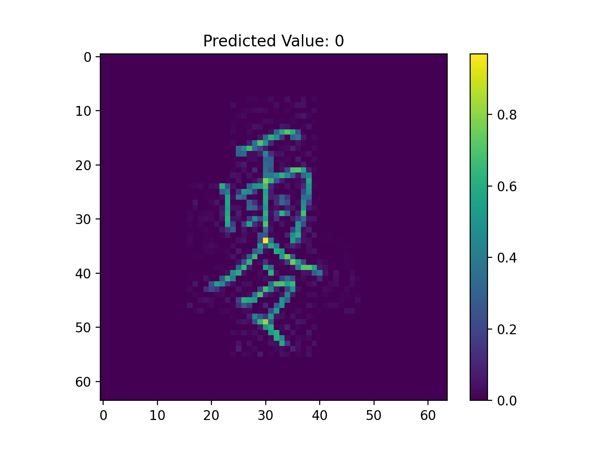
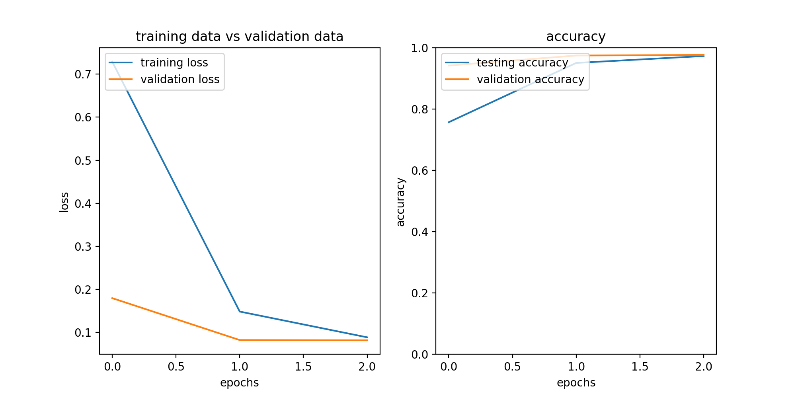
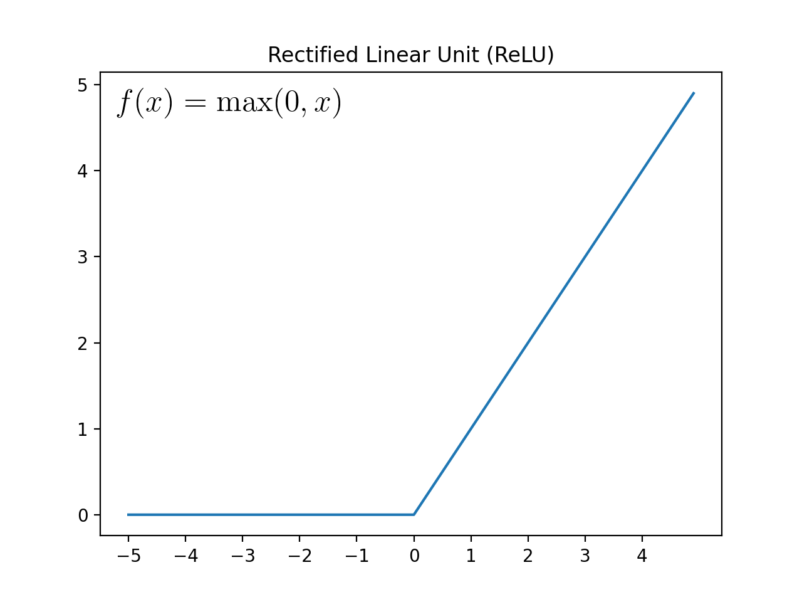
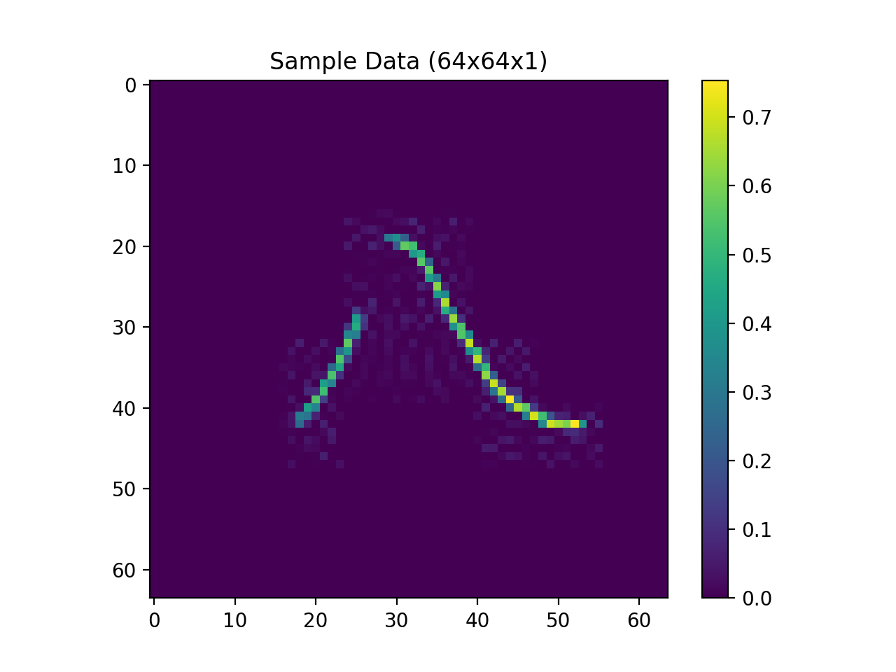

<h1 align="center">tf2-chinese-mnist</h1>
<p align="center">TensorFlow application that could recognize handwritten Chinese numerals using a custom CNN architecture.</p>





## Convolutional Neural Network


### Architecture


```
Model: "sequential"
_________________________________________________________________
Layer (type)                 Output Shape              Param #   
=================================================================
conv2d (Conv2D)              (None, 64, 64, 32)        320       
_________________________________________________________________
max_pooling2d (MaxPooling2D) (None, 32, 32, 32)        0         
_________________________________________________________________
conv2d_1 (Conv2D)            (None, 32, 32, 64)        18496     
_________________________________________________________________
max_pooling2d_1 (MaxPooling2 (None, 16, 16, 64)        0         
_________________________________________________________________
conv2d_2 (Conv2D)            (None, 16, 16, 128)       73856     
_________________________________________________________________
max_pooling2d_2 (MaxPooling2 (None, 8, 8, 128)         0         
_________________________________________________________________
flatten (Flatten)            (None, 8192)              0         
_________________________________________________________________
dense (Dense)                (None, 1024)              8389632   
_________________________________________________________________
dense_1 (Dense)              (None, 512)               524800    
_________________________________________________________________
dense_2 (Dense)              (None, 256)               131328    
_________________________________________________________________
dense_3 (Dense)              (None, 15)                3855      
=================================================================
Total params: 9,142,287
Trainable params: 9,142,287
Non-trainable params: 0
_________________________________________________________________
```


### Performance





### Activation Functions


#### Rectified Linear Unit (ReLU)


ReLU is used on all convolutional and dense layers except for the output layer (last dense layer).





#### Softmax


Since we are predicting a class of probabilities, we are going to use the Softmax activation function for our output layer.


## Data


[Kaggle Dataset](https://www.kaggle.com/gpreda/chinese-mnist)





## Copyright


Developed and Designed by Justine Paul Sanchez Vitan.


Copyright © 2022 Justine Paul Sanchez Vitan. All rights reserved.
